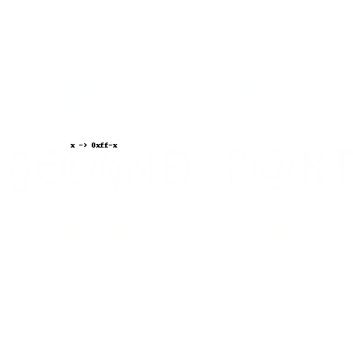
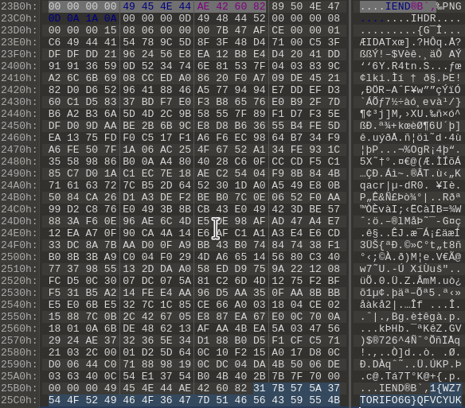
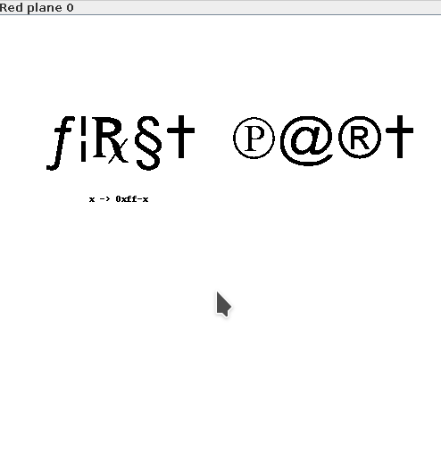
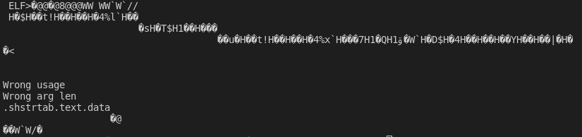
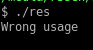
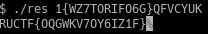

# Странная картинка
## Задание 

Говорят, что в этом изображении есть что-то интересное. Сможете найти?.

## Решение
Открыв картинку, мы видим формулу, которая нам делает подсказку, что надо что-то вычесть из 255.
Открываем картинку в hex-редакторе, в конце картинки можно заметить еще одну маленьку картинку и строку, похожую на флаг.

Вытаскиваем ее из исходной и получем следующее(8x21px): 

Теперь, если исходную картинку посмотреть в stegsolve, то можно увидеть еще три надписи, причем каждую надпись видно в отдельном канале.

Из этого делаем вывод, что на каждый канал приходится своя часть флага.
Теперь снова возвращаемся к маленькой картинке.

Попробуем обратится к каждому каналу каждого пикселя в соотвествии с подсказками: сначала собираем строку по красному каналу, вычитая из 255 каждое значение, потом аналогично по зеленому и т.д.. Для этого напишем небольшой скрипт на python. Если полученные значения перевести в char, то можно увидеть заголовок исполняемого файла elf

Следовательно, все вытащенное записываем в файл и пытаемся запустить. Видим следующую надпись: 

Если попробовать подать в качестве аргумента строку, найденную выше, то получим флаг: 

P.S. Скрипт для решения приведен [здесь](get_data.py)
